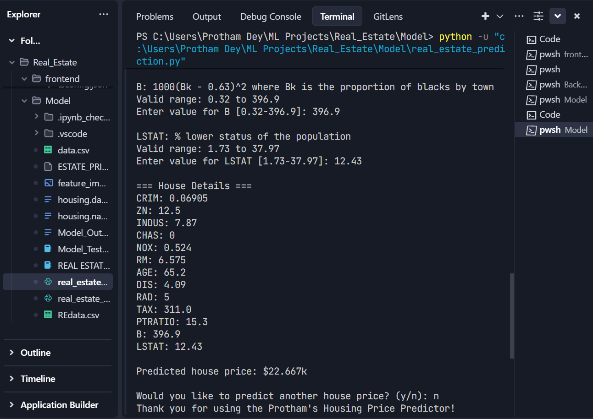
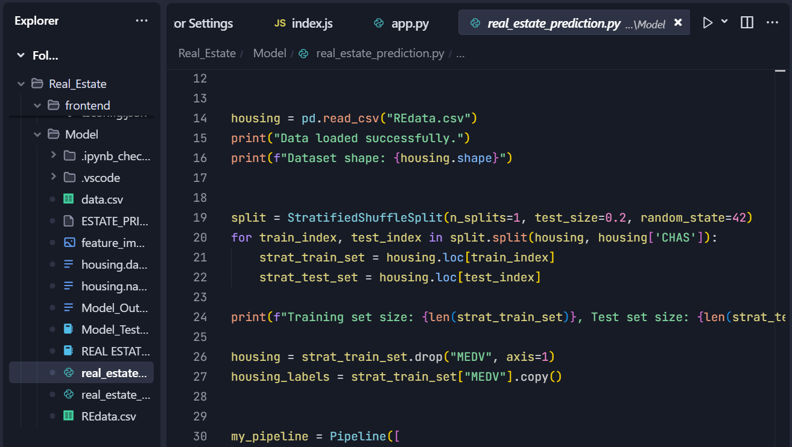
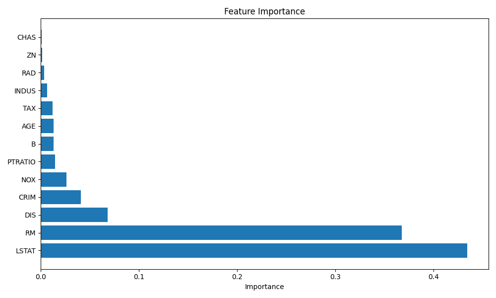

## 🧪 Sample CLI Prediction Output



---

## 📊 Model Evaluation Metrics




# 🏠 Real Estate Price Predictor using Machine Learning

This is a machine learning project that predicts real estate housing prices based on the **Boston Housing Dataset**. It uses a fine-tuned **Random Forest Regressor** along with **data preprocessing pipelines** and **hyperparameter optimization** using `GridSearchCV`.

## 📊 Dataset

The model uses the classic [Boston Housing Dataset](https://www.cs.toronto.edu/~delve/data/boston/bostonDetail.html), where:
- The target variable is `MEDV`: Median value of owner-occupied homes in $1000s.
- 13 input features are used (e.g., crime rate, room count, tax rate, etc.).

## 🚀 Features

- Data loading and preprocessing using Scikit-Learn pipelines
- Stratified train-test split based on `CHAS` feature
- Missing value imputation and feature scaling
- Model training with Random Forest Regressor
- Hyperparameter tuning using `GridSearchCV`
- Cross-validation with RMSE metric
- Custom prediction function from user inputs
- Feature importance visualization (`feature_importance.png`)
- CLI-based interaction to predict price from user-defined input

## 🛠️ Installation

Clone the repository and install required packages:

```bash
git clone https://github.com/ProthamD/Real_estate_PricePredictor_ML.git
cd Real_estate_PricePredictor_ML
pip install -r requirements.txt
````

### Required Libraries

Ensure you have the following Python libraries installed:

```bash
pandas
numpy
scikit-learn
matplotlib
joblib
```

> You can generate a `requirements.txt` using:
>
> ```bash
> pip freeze > requirements.txt
> ```

## 📂 Project Structure

```
real_estate_prediction.py       # Main script
REdata.csv                      # Boston housing dataset (expected in the same folder)
feature_importance.png          # Output plot after model training
ESTATE_PRICE_CALCULATOR.joblib  # (Optional) Saved model file
README.md                       # This file
```

## 🧪 How to Use

To run the prediction script interactively:

```bash
python real_estate_prediction.py
```

You will be prompted to input values for the 13 housing features. Example:

```
CRIM: Per capita crime rate by town
Valid range: 0.00632 to 88.9762
Enter value for CRIM [0.00632-88.9762]: 0.1
...
Predicted house price: $24.327k
```

## 🧠 Model Evaluation

* Best parameters found via GridSearchCV:

  ```
  {'n_estimators': 300, 'max_depth': 20, 'min_samples_split': 2}
  ```

* Final evaluation:

  * Training RMSE: \~1.17
  * Cross-validation RMSE: \~2.38 ± 0.33
  * Test RMSE: \~2.82

## 📈 Feature Importance

The model prints and saves the importance of each feature after training:



## 🧾 License

This project is licensed under the MIT License.

---

## 👤 Author

**Protham Dey**
📧 [protham.dey@gmail.com](mailto:protham.dey@gmail.com)
🌍 [Portfolio](https://prothamd.github.io/My-Portfolio-latest/)

```

---

Let me know if you'd like to include sections for deployment (e.g., Streamlit or web API), or turn this into a web app with React/Flask.
```
